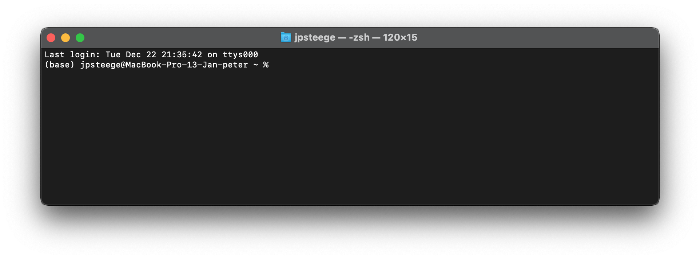
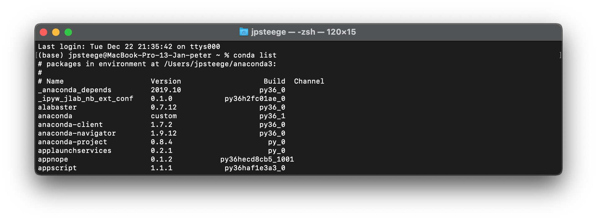

# Christmas Tree  :christmas_tree:

Small repository to create a chirstmas tree picture using Python and Turtle. This image is used for our personal christmas card.

Want to explore the code by yourself? Please follow these steps:

### Get Python and Jupyter up and running
1. Install Python to you personal computer. A simple start is using Miniconda (https://docs.conda.io/en/latest/miniconda.html), you should select here a Python 3.x version in 64-bit. For Mac, select the PKG variant. If the installer asks you if you want to add miniconda to your PATH, this is handy to do. 
2. If Miniconda is installed, open a code editor that comes with it. If you added the installation to your path, you can use the standard code editors on your machine.
      - For Windows this is PowerShell (or use Anaconda PowerShell Prompt under Start > Anaconda)
      - For Mac this is Terminal (Application > Utilities > Terminal)   
   You can check if conda is installed correctly: in the editore '(base)' should be the prefix of the row. 
   
   A second test is to type `conda list`, a list with installed packages should be visible. 
   
   
3. With the editor open, install Jupyter Lab, to easy read an write code in your browser in so called 'notebooks'. You can do this by typing the command:  
   `conda install jupyterlab -y`  
   Now a lot of rows will be written to show you what will be downloaded and installed. If you see the message 'Executing transaction: done', then the installation is successful
4. Jupyter must recognize your python instance. Therefore, type the following command:  
   `ipython kernel install --name 'Python 3 (Conda)' --user`

### Download the code
5. Download the code of this repository. In the upper right corner of this screen, click on the green 'Code'-button and then select 'Download ZIP'.  
   Once downloaded, extract the ZIP-file

### Start up
6. Open a code editor instance in the just downloaded folder. You can achieve this on 2 ways:
   
   Method A:
      1.    Find the system path of the just downloaded folder, which you can find using Windows Explorer or Mac Finder.  
      2.    In the text editor go to the folder you just downloaded. This can be done by typing the following command:  
            `cd '<path>'`  
             
            You know should notice that the path you just entered is visible in the code editor
   
   Method B:
      1.    Go to the folder and click with the right mouse button. Select 'Open PowerShell/Command Prompt here' (Windows)... 
            (hold shift while right clicking if option is not visible) 
            
      
            ... or 'Open terminal here' (Mac) 
            

8. Now start Jupyter using the following command:  
   `jupyter lab`  
   A browser link becomes visible, which you can open.
    
9. Open the notebook (file that ends with .ipynb). You now can see and run the code cells.
    

   
